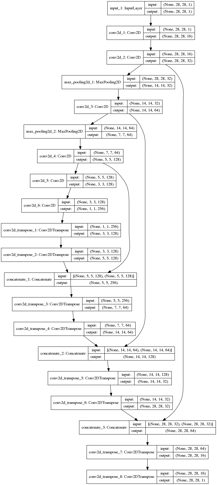

# U-Net
Deep autoencoder with skip connection neural networks, which also called U-Net.

The constructure:


U-Net.ipynb uses keras with tensorflow backend.


# Results


The six pictures in first row are the original pictures.

The second are the damaged pictures which rows of 10 to 18 were coverd by zeros.

The third are the results of the U-Net.ipynb

# Usage
```
git clone https://github.com/block98k/U-Net-keras.git
cd ./U-Net-keras
jupyter notebook U-Net.ipynb
```

# Prerequisites
**tensorflow** 1.0 or above

**numpy**

**scipy**

**jupyter**

# Acknowledgement
This is a project I used to practice autoencoder and U-Net.

